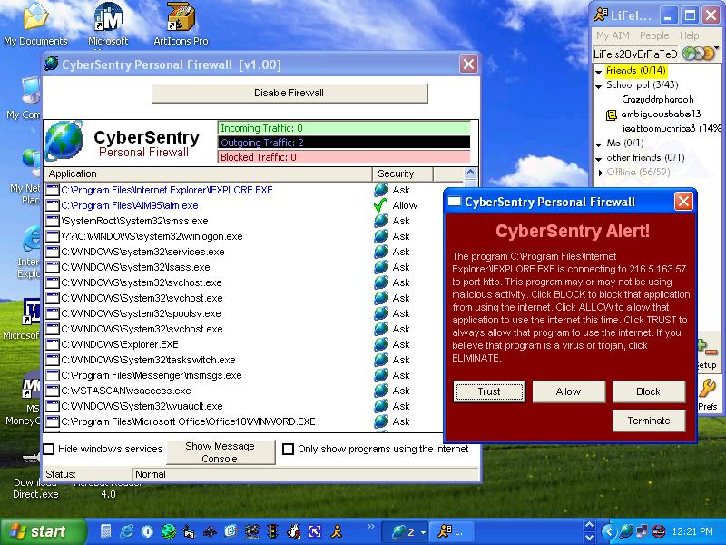



## Real Working VB Firewall

### Description

[UPDATED W/ MISSING CODE!] Dun Dun Dun Dun Dun Dun! Finally a real working vb firewall that just doesnt use TCP or winsock! (Download now only 80kb!) It accesses the windows system, stopping connections and brining up a query window to allow it or not! Just like professional Firewall applications! It detects ALL internet applications running on your computer! CyberSentry Personal Firewall Beta has been completed. However, i will not post the full version YET! (Full version has popup filtering, parental controls, ad filtering, attachment filtering, full application control, registry monitor and a makeshift virus scanner) I want some feedback and or votes before i post the full version code.
 
### More Info
 

             |
---                |---
**Submitted On**   |2003-06-07 14:18:16
**By**             |[Insomnia Software](https://github.com/Planet-Source-Code/PSCIndex/blob/master/ByAuthor/insomnia-software.md)
**Level**          |Advanced
**User Rating**    |3.3 (69 globes from 21 users)
**Compatibility**  |VB 5\.0, VB 6\.0
**Category**       |[Internet/ HTML](https://github.com/Planet-Source-Code/PSCIndex/blob/master/ByCategory/internet-html__1-34.md)
**World**          |[Visual Basic](https://github.com/Planet-Source-Code/PSCIndex/blob/master/ByWorld/visual-basic.md)
**Archive File**   |[Real\_Worki159802672003\.zip](https://github.com/Planet-Source-Code/insomnia-software-real-working-vb-firewall__1-46026/archive/master.zip)

